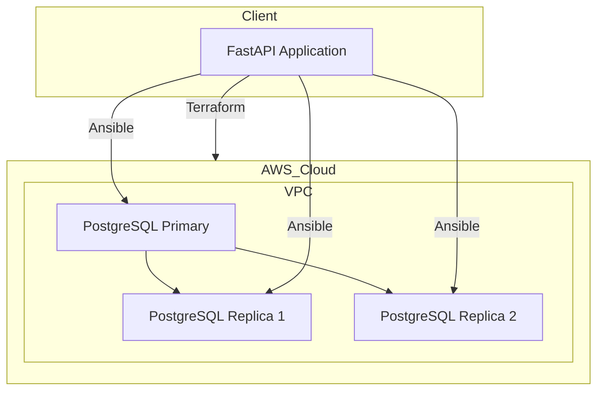
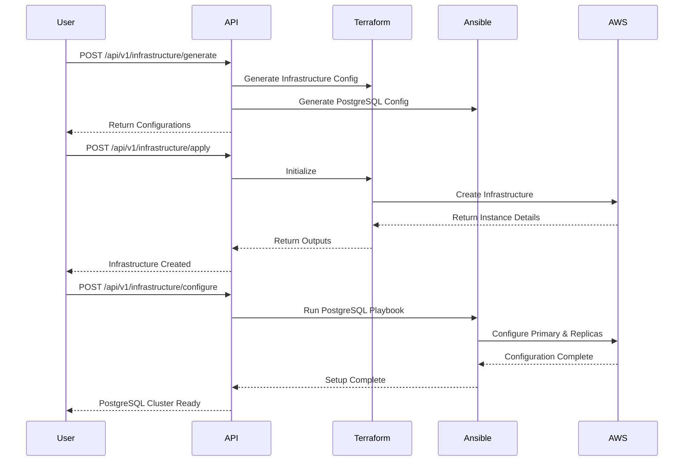

# PostgreSQL Automation Platform

A robust platform for automating PostgreSQL primary-replica setup on AWS using Terraform and Ansible.

## 🏗 Architecture



## 🔄 Workflow



## 🚀 Features

- Automated PostgreSQL primary-replica setup
- Infrastructure as Code using Terraform
- Configuration Management with Ansible
- RESTful API with FastAPI
- Monitoring and logging integration
- Customizable PostgreSQL configurations
- Multi-environment support

## 📋 Prerequisites

- Python 3.8+
- Terraform
- Ansible
- AWS Account and configured credentials
- SSH key pair for EC2 instances

## 🛠 Installation

1. Clone the repository:
```bash
cd postgres-automation
```

2. Create and activate virtual environment:
```bash
python -m venv venv
source venv/bin/activate  # Linux/Mac
# or
.\venv\Scripts\activate  # Windows
```

3. Install dependencies:
```bash
pip install -r requirements.txt
```

4. Configure environment variables:
```bash
cp .env.example .env
# Edit .env with your configurations
```

## 🏃‍♂️ Running the Application

1. Start the API server:
```bash
uvicorn api.main:app --reload --host 0.0.0.0 --port 8000
```

2. Access the API documentation:
```
http://localhost:8000/docs
```

## 📝 API Usage

1. Generate Infrastructure Configuration:
```bash
curl -X POST http://localhost:8000/api/v1/infrastructure/generate \
  -H "Content-Type: application/json" \
  -d '{
    "postgresql_version": "14",
    "instance_type": "t3.medium",
    "replica_count": 2,
    "max_connections": 100,
    "shared_buffers": "1GB",
    "vpc_id": "vpc-xxxxxx",
    "subnet_ids": ["subnet-xxxxx", "subnet-yyyyy"],
    "environment": "development"
  }'
```

2. Apply Infrastructure:
```bash
curl -X POST http://localhost:8000/api/v1/infrastructure/apply
```

3. Configure PostgreSQL:
```bash
curl -X POST http://localhost:8000/api/v1/infrastructure/configure
```

## 🔍 Monitoring

The application includes:
- Prometheus metrics
- Logging with Loguru
- Health check endpoints
- AWS CloudWatch integration

## 🧪 Testing

Run the test suite:
```bash
pytest
```

## 🔐 Security

- VPC isolation
- Security group restrictions
- SSH key authentication
- Encrypted communication
